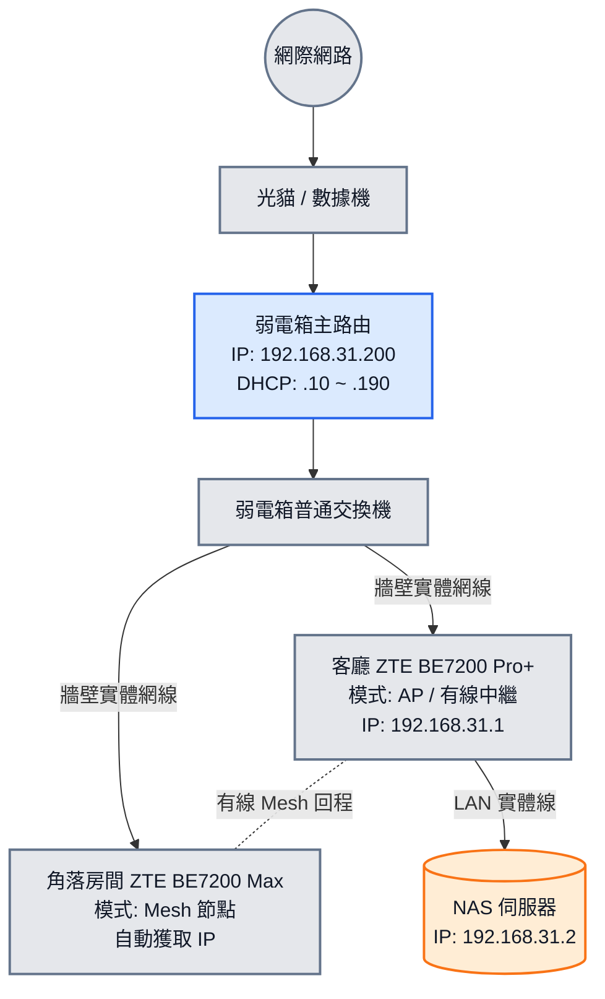
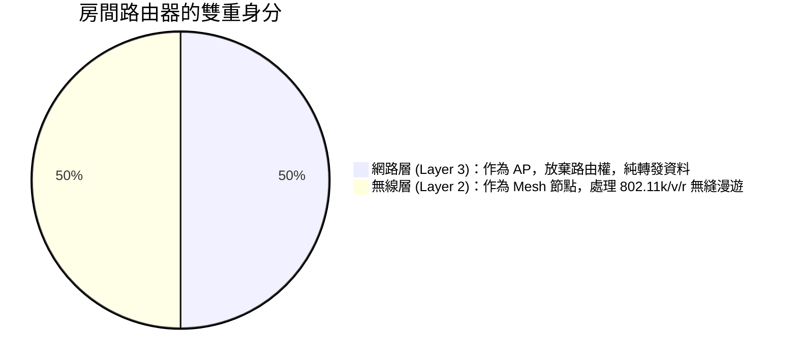

## 前言

最近在調整家裡的網路佈線，遇到了一個很多家庭都會踩坑的「經典痛點」：**客廳只有一個實體網孔，但想要組建全屋有線 Mesh**。

其實一開始我是用普通的路由器，後來因為網路有些問題請了師傅上門，他幫我改成了 **PoE (Power over Ethernet) 供電方案**（弱電箱放 PoE 交換機，房間用支援 PoE 的設備）。客觀來說，PoE 省了電源線，整體確實乾淨俐落。但我這人就是手癢想折騰，加上希望對家裡的設備、路由功能與 NAS 存取有更高的掌控度，所以我又把 PoE 設備撤下，換回傳統路由器繼續折騰。

在這次改造過程中，關於中興 (ZTE) 路由器的改裝與設定邏輯，我參考了這部 B 站教學影片，從中獲得了不少啟發。

::bilibili{bvid="BV1YR4y1q7tX" title="中兴路由器刷机改版教学 (BV1YR4y1q7tX)"}

這篇筆記就來紀錄一下，我是如何利用「弱電箱主路由 + AP 模式」來破局的。

### 本文實際設備

- 客廳路由器：中興 ZTE `BE7200 Pro+`
- 角落房間路由器：中興 ZTE `BE7200 Max`
- NAS：固定 IP `192.168.31.2`

這次能順利組起有線 Mesh，也和兩台設備同屬中興生態有關。雖然型號不同，但在同品牌 App 與 Mesh 協定下，依然可以正常完成配對與有線回程。

## 改造前的問題：無法建立有線回程與 IP 衝突

在標準的有線 Mesh 拓撲中，節點必須是樹狀結構。但如果直接把客廳當主路由，客廳唯一的網線就被 WAN 口佔用了，LAN 口的訊號回不去弱電箱的交換機，房間的路由器自然抓不到主路由，只能被迫跑無線 Mesh。

為此，我決定在弱電箱新增一台路由器來當作全家網路的「大腦」，負責撥號和分配 IP。

但這裡遇到一個致命陷阱：**WAN / LAN 網域衝突**。
我的 NAS 原本接在客廳路由器下，並且綁定了固定 IP `192.168.31.2`。為了不改 NAS 設定（避免電腦和手機的備份路徑全部失效），我打算把弱電箱新主路由的 IP 也設成 `192.168.31.x` 網段。如果客廳的路由器沒有切換模式，它自身的區域網也是 `192.168.31.x`，這會導致客廳路由器的上下游（WAN 口和 LAN 口）網段重疊，整個網路會直接癱瘓。

### 解決方案架構圖

為了解決網域衝突並成功建立 Mesh，最終的完美架構如下圖所示：

---

## 實戰配置步驟

整個配置過程必須嚴格按照順序進行，避免設定中途網路斷線或 IP 衝突導致進不去管理後台。

### 第一步：弱電箱主路由設定與 DHCP 劃分

這是核心關鍵。我們要把網路的路由權交給弱電箱，但要「保護」好我們預留的靜態 IP。

1. 登入弱電箱主路由後台，將 LAN IP 變更為：`192.168.31.200`。
2. **修改 DHCP 位址池**：將自動分配的範圍設定為 `192.168.31.10` 到 `192.168.31.190`。

> **💡 為什麼要這樣做？** > 我們刻意把 `.1` 到 `.9` 的 IP 位址空出來。這樣弱電箱主路由就不會把這些 IP 分配給其他連網的手機或平板，完美避開了客廳路由器 (`.1`) 和 NAS (`.2`) 的 IP 衝突風險。

### 第二步：客廳路由器切換 AP 模式

在客廳路由器還沒接上弱電箱之前（或者透過 Wi-Fi 進入它的後台 `192.168.31.1`）：

1. 將工作模式從「無線路由模式」修改為 **「AP 模式」**（有些廠牌叫「有線中繼模式」或「橋接模式」）。
2. 將 IP 獲取方式設定為 **「固定 IP (靜態 IP)」**：
* **IP 位址**：`192.168.31.1` (保留原本習慣的管理介面入口)
* **子網路遮罩**：`255.255.255.0`
* **預設通訊閘 (Gateway)**：`192.168.31.200` (指向弱電箱主路由)
* **DNS**：`192.168.31.200` 或 `8.8.8.8`

儲存並重啟後，客廳路由器就正式降級為一個純粹的「無線發射器」，同時開啟了雙頻合一。而接在它 LAN 口的 NAS (`192.168.31.2`) 也能直接融入整個家庭的 `192.168.31.x` 大網域中。

### 第三步：房間路由器配對與有線 Mesh 組建

最後一步就是把房間的路由器加進來。為了避免辨識錯誤，強烈建議採用 **「先無線配對，後插線回程」** 的做法：

1. **重置 (Reset)** 房間的路由器，先不插網線，只插電源。
2. 將它拿到客廳路由器旁邊，打開手機上的路由器品牌 App。
3. 在 App 中選擇「添加 Mesh 節點」，讓兩台設備透過無線完成配對（此時房間路由器會自動同步客廳的 Wi-Fi 名稱與密碼）。
4. 配對成功後，將房間路由器斷電，拿回房間。
5. 重新插上電源，並**將牆壁的網線插入路由器的 WAN 口**。

稍等片刻，App 裡的網路拓撲圖就會顯示兩台路由器之間已經建立了「有線連接（Ethernet Backhaul）」，大功告成！

---

## 觀念解析：它是 AP 還是 Mesh？

設定完後，我一度有個疑惑：房間的副路由現在到底是作為 AP，還是 Mesh？
答案是：**兩者皆是，它們在不同網路協定層面上扮演著不同角色。**

1. **從「網路層（IP 分配）」來看，它是 AP**：
客廳和房間的路由器都關閉了自身的 DHCP，不負責分配 IP。它們全權聽命於弱電箱的 `192.168.31.200`，這在網路定義上就是標準的 AP (Access Point)。
2. **從「無線管理（Wi-Fi 漫遊）」來看，它是 Mesh 節點**：
普通的 AP 之間是各自為政的，手機切換訊號會斷線。但我們設定的是同品牌的 Mesh 系統，它們在 AP 模式下依然保留了無線晶片間的**漫遊協定 (802.11k/v/r)**。當我從客廳走到房間，系統會自動將我的手機無縫踢換到訊號最好的節點。

> **⚠️ 小提醒**：記得把弱電箱主路由自身的 Wi-Fi 功能（如果有）關閉，以免干擾客廳與房間 Mesh 系統的無縫漫遊體驗。

## 結語

從最初的單純路由，到師傅幫忙改的 PoE 方案，再到現在因為手癢改回來的「主路由 + AP Mesh」架構，確實折騰了一番。但成果是非常值得的：

現在全家只有一個 Wi-Fi 名稱，走到哪訊號都是滿格，且無縫漫遊切換極快。最棒的是，NAS 的 IP 完全不需要變動，之前設定在電腦和手機裡的備份路徑全部無痛銜接。既享受了有線 Mesh 的穩定，又保留了對區域網路的絕對控制權，算是把手邊設備的價值榨乾到了極致！
